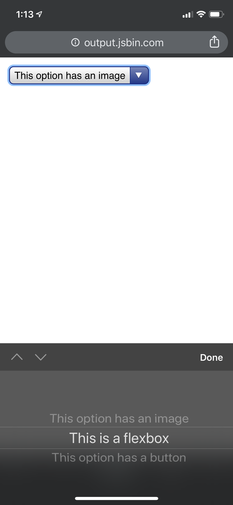
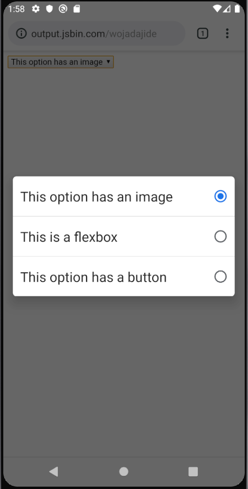

# Progressive Enhancement of the Select Control on Mobile

In building a new `<select>` control, a key consideration is progressive enhancement—that is, ensuring that users with browsers that do not yet support the new `<select>` can fall back to the old implementation without issue. On mobile this is particularly important, as both iOS and Android prompt a native UI for operating the `<select>`, inherently limiting its potential for customization compared to desktop.

The purpose of this page is to confirm that, if arbitrary HTML content is inserted into the `<select>`, the control will still work on mobile.

To evaluate this hypothesis, a representative case of a `<select>` including an image, flexbox, and button within its `<option>`s was created ([see code](https://jsbin.com/wojadajide/edit?html,output)).

As shown in the screenshots below, both iOS and Android stripped out all non-text content, confirming that progressive enhancement on mobile should work as expected.

## iOS

## Android
