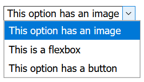
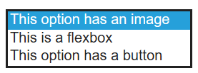
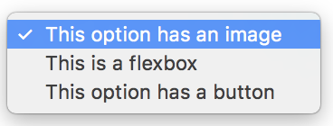

# Progressive Enhancement of the Select Control

In building a new `<select>` control, a key consideration is progressive enhancement—that is, ensuring that users with browsers that do not yet support the new `<select>` can fall back to the old implementation without issue. The purpose of this page is to verify this principle, i.e. that if arbitrary HTML content is inserted into the `<select>`, the control will strip out all non-text content and still function.

This was verified by creating a representative case of a `<select>` with an image, flexbox, and button within its options ([see code](https://jsbin.com/wojadajide/edit?html,output)) and testing across browsers on desktop and mobile.

## Desktop
### Chrome on Windows

### Firefox on Windows

### EdgeHTML on Windows

### Safari on Mac

## Mobile
Note that both iOS and Android prompt a native UI for operating the `<select>`, which inherently limits its potential for customization with non-text content compared to desktop.
### iOS

### Android

