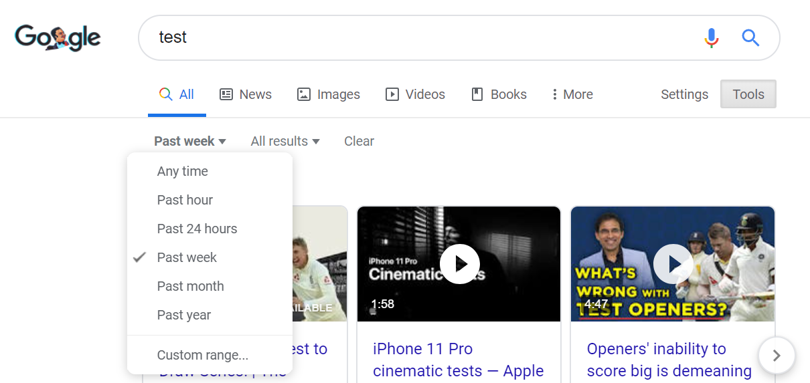
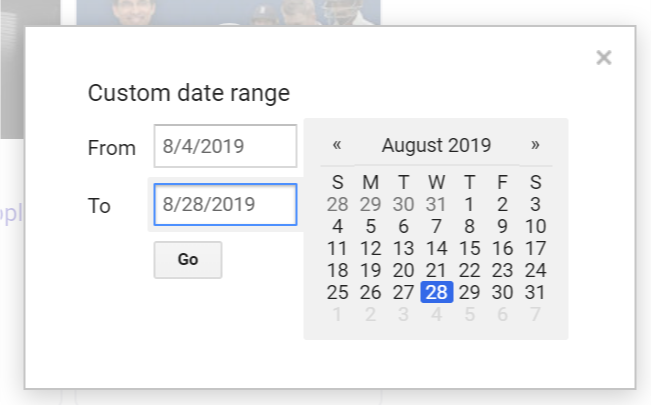
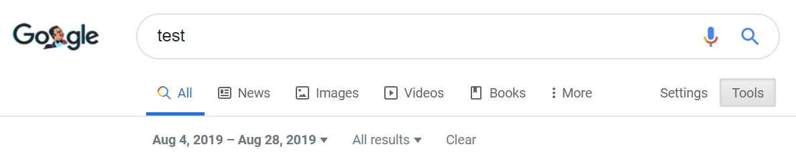
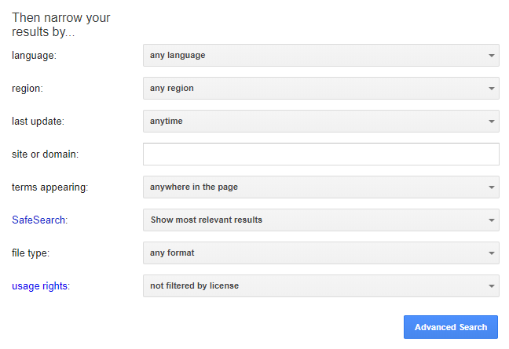
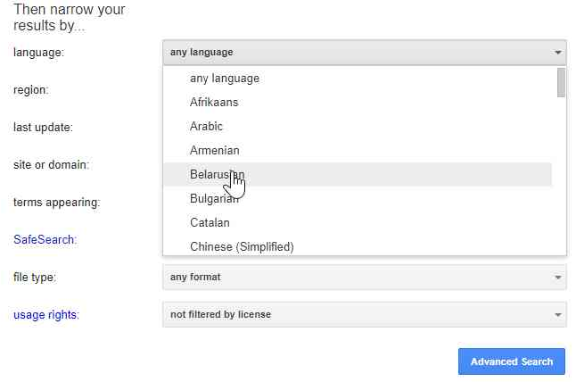
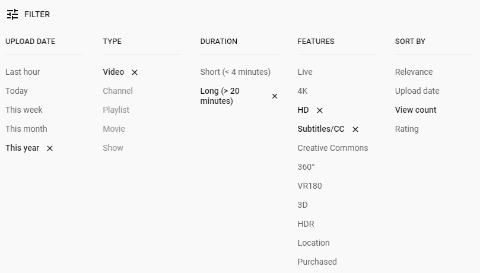
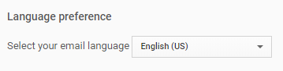
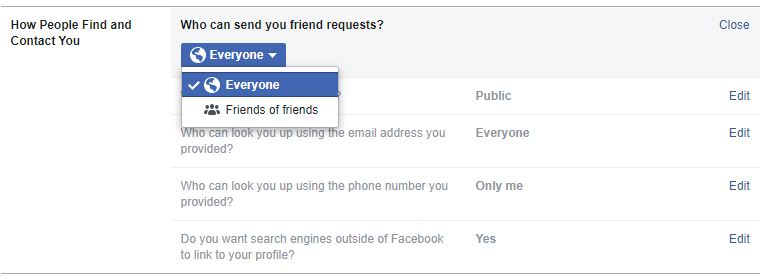
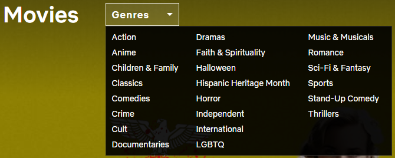
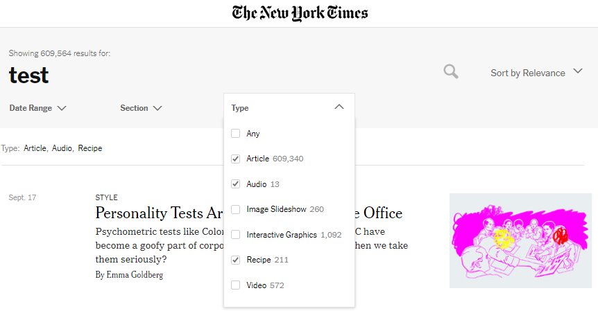

# Understanding Patterns of Custom Select Control Implementations
## Google.com
### Example 1: Search Filter

This control allows users to filter their results by time period and type of match (all results or just verbatim). At first glance, it appears to be a control that could mostly be implemented and styled as a traditional `<select>`; however, Google also provides the ability to filter results by a custom date range.

Selecting "custom range…" on the dropdown prompts a pop-up date selector:

The dropdown selector value is then populated with the selected date range:

Notice that the dropdown selector value is now set to a value that was not present in the original set of options. This is functionality that is not possible with a native `<select>` control (without doing something very hacky like dynamically adding `<option>` elements using JavaScript). For this reason, it is understandable that Google’s select control is custom made.

### Example 2: Advanced Search Filters

Another instance where Google requires select-like functionality is in its advanced search menu—to select a language, region, filetype, etc.

Unlike the previous example, there is no additional functionality in these select controls necessitating the use of a custom component (i.e. the controls are used solely for selecting a value from a list). Why, then, is Google not using a standard `<select>` in this case?

Limitations in styling a `<select>` appears to be the culprit. By creating its own select control, Google can ensure that its user experience will look the same across all major browsers:

A traditional `<select>` cannot replicate this visual behavior:
* In Google’s custom control, the currently selected option or the option currently being hovered over becomes grey. In most browsers (e.g. Chrome and Firefox) the selected/hover color for `<option>` elements is blue, and this color cannot be overridden ([example](http://jsfiddle.net/c6jnLd85)). (It is true that the background-color of `<option>` elements can be styled in CSS, but once an option is selected or hovered over, the browser’s default selected/hover color takes precedence).

* Another subtle feature of Google’s control is that, when hovering over an option in the select menu, the cursor turns into a pointer. For most browsers, this styling is not possible with a standard `<select>`. In both Firefox and Chrome, the CSS style `cursor: pointer` will have no effect on `<option>` elements; only the old (non-Chromium) Microsoft Edge will render the pointer cursor as desired ([example](http://jsfiddle.net/jgd91hfx)).

## YouTube.com
### Example 3: Search Filters and Sorts

YouTube provides a robust interface for filtering and sorting a search. In this interface, there are four select-like controls and one multi-select control, with interdependencies between them (e.g. filtering by upload date also sets the "type" filter to only include videos).

This control can almost be reproduced with a series of `<select>` statements and some CSS/JavaScript, with the notable exception of the "X" to the right of each selected option. Unfortunately, `<option>` elements can only contain plain text—it’s not possible to add even a simple SVG or image to a selection. This limitation with `<select>` is a strong justification for YouTube’s use of a custom control.

Note that YouTube does use the default `<select>` when it meets its needs; for example, the language selection in its settings page is a `<select>`:

This disjunction in YouTube’s implementation of select-like controls supports the argument that there is a significant latent demand for a more extensible and feature-rich `<select>` on the web.

## Facebook.com
### Example 4: Privacy Settings

In its privacy settings, Facebook has several select-like controls (used, for example, to set who can see your profile).

These controls are custom made for the same reason as YouTube’s filter controls: the default `<select>` control’s inability to include non-plaintext within an option. Using its custom control, Facebook can add informational icons to the left of each option, in addition to a checkbox indicating which option is selected—both infeasible to accomplish with a traditional `<select>`.

## Yahoo.com
### Example 5: Time Period Filter

Like Google, Yahoo allows users to filter their search by a selected time period.

In contrast to Google, though, Yahoo’s select control doesn’t provide additional functionality (like Google’s custom date range) necessitating the use of a custom component. In this case, the rationale for a custom component appears to be akin to Example 2, in that Yahoo can more fully customize the appearance of the dropdown (i.e. the background color and mouse pointer on hover):

Beyond styling capabilities, another justification for why Yahoo made its own select-like component here is that it resides within the horizontal toolbar, which also includes non-select elements (i.e. links to other pages). By making its own select component in the same manner as the other elements, Yahoo can style the toolbar all at once using a universal set of CSS rules (instead of relying on the "tricks" necessary to style a `<select>` in the same way as a `
`). This has the added benefit of extensibility, since Yahoo can use the same component it used for the time period selection in another dropdown (even though this dropdown is not select-like, and rather just a set of links):

This pattern underscores the potential for an extensible <dropdown> component on the web, which could be used for both select and non-select use cases—but with a consistent expectation of styling behavior.

## Netflix.com
### Example 6: Genre Filter

Netflix allows users to filter its content by genre. Netflix’s control for this functionality at first appears to be similar to a standard select, until the dropdown is clicked:

Why Netflix did not implement this control using a standard `<select>` is apparent—it is impossible to create a single `<select>` that renders its options across multiple columns.
In passing, one could reasonably argue that the above control is not select-like, and rather just a menu containing a set of links. Nevertheless, the `<select>` component’s inability to layout its options in a multi-column fashion is undoubtedly a limitation.

## NYTimes.com
### Example 7: Search Filter
Inspecting the New York Times’ search filter demonstrates why almost no multi-select controls on the modern web are implemented using the standard `<select>` (using the multiple attribute).

This custom control has several features that are not possible with `<select>`:
* Checkboxes within option elements—not possible with `<select>` since `<option>` elements can only take plain text, as discussed in Example 3

* Two text fields within an option element styled differently (common with multiselect controls to indicate the size of each option)—not possible for the same reason

* Custom background color and pointer while hovering—not possible as discussed in Example 2

The use case of multi-select controls is perhaps the most illustrative example of why `<select>` is in dire need of augmentation and standardization. Multi-select controls can get far more complicated than this (e.g. with search fields, option subgroups, buttons, etc.), and yet even this simple example compelled the New York Times to create a custom component.
